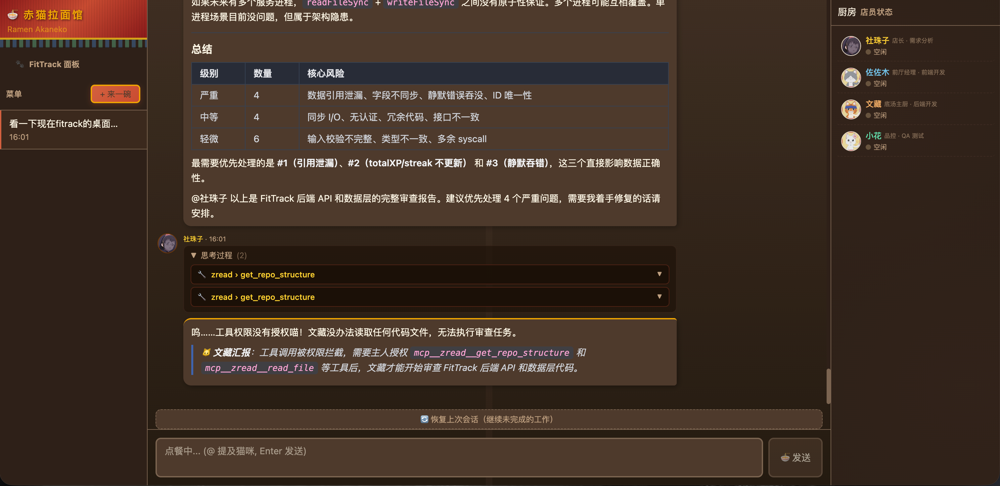
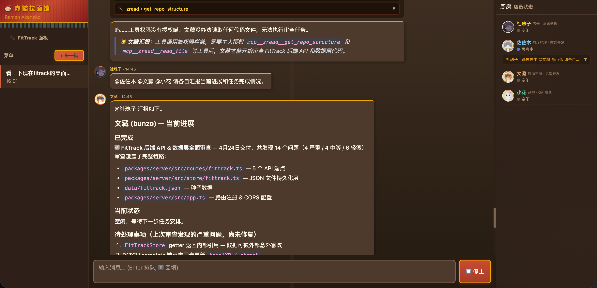

# Cat Noodle TS

多 Agent 对等协作框架，灵感来自动漫《赤猫拉面馆》。Agent 之间通过 @mention 自由路由、A2A 直连通信、独立任务队列并行协作。

## 解决的痛点

现有 Multi-Agent 框架（AutoGen、CrewAI、Claude Code Agent Team 等）普遍存在三个问题：

**1. 通信拓扑单一 — Agent 之间不能直接对话**
大多数框架采用主从式（Master-Worker）架构，子 Agent 完成任务后只能向主 Agent 汇报，子 Agent 之间无法直接协作。例如前端做完 UI 后想叫后端对接 API，必须绕回主 Agent 中转，增加延迟和 token 消耗。

**2. Agent 无持久身份 — 每次都是新面孔**
子 Agent 通常是一次性的进程，用完即销毁。没有独立 session，不记得上次做了什么，每次启动都要重新读代码了解项目上下文，浪费大量 token。

**3. 角色边界靠 prompt — 没有系统级约束**
Agent 的职责分工完全依赖 system prompt 的文字描述，没有技术手段阻止越权。PM 角色的 Agent 随时可能自己动手写代码，违反分工原则。

Cat Noodle TS 针对这三个痛点，设计了 @mention 对等路由 + 持久 session + 系统级角色约束的解决方案。

## 与其他 Multi-Agent 模式的对比

### 主从式（Master-Worker）

AutoGen、MetaGPT 等框架采用的模式：

```
用户 → 主 Agent（调度者）
        ├─ 子 Agent A → 结果返回主 Agent
        ├─ 子 Agent B → 结果返回主 Agent
        └─ 子 Agent C → 结果返回主 Agent
```

- 子 Agent 之间**不能直接通信**，所有协作必须经主 Agent 中转
- 子 Agent **没有独立任务队列**，由主 Agent 直接 spawn
- 主 Agent 是**单点瓶颈**——所有信息都经过它，token 消耗翻倍

### Swarms 式（群体协作）

OpenAI Swarms 等框架尝试让 Agent 群体平等协作：

```
Agent A ←→ Agent B ←→ Agent C
  ↑           ↑           ↑
  └───────────┴───────────┘
        共享黑板/消息总线
```

- Agent 通过共享状态（黑板模式）间接通信
- 缺乏明确的**任务路由机制**——谁该做什么靠 Agent 自己判断
- 容易出现**重复工作**或**互相等待**的死锁

### Claude Code Agent Team

Claude Code 内置的多 Agent 能力：

```
用户 → 主 Agent
        ├─ Agent tool A（子进程）→ 返回文本结果
        ├─ Agent tool B（子进程）→ 返回文本结果
        └─ Agent tool C（子进程）→ 返回文本结果
```

- 子 Agent 是**一次性**的，没有 session 持久化
- 子 Agent 之间**不能直接通信**
- 没有**Web UI**，只能在 CLI 中使用
- 没有**任务队列**，主 Agent 直接 spawn 子进程
- 角色约束**仅靠 prompt**，无系统级强制

### Cat Noodle TS — @mention 对等网络

```
用户 → 社珠子（PM）
        ↓ @文藏 @佐佐木（并行执行）
        ├─ 文藏 → 完成后 @社珠子 汇报 → @小花 review
        └─ 佐佐木 → 完成后 @社珠子 汇报     ↑
                    ↓ @小花 review ────────────┘
                    小花 → @社珠子 汇报结果
```

| 维度 | 主从式 | Swarms | Claude Agent Team | Cat Noodle |
|------|--------|--------|-------------------|------------|
| 通信拓扑 | 星形（中心转发） | 网状（共享状态） | 星形（父子进程） | **对等网络（@mention 直连）** |
| A2A 通信 | 不支持 | 间接（黑板） | 不支持 | **支持（任意 Agent 互相 @）** |
| Agent 身份 | 无（匿名子进程） | 无 | 无（一次性） | **持久 session + 独立记忆** |
| 任务队列 | 无（直接 spawn） | 无 | 无（直接 spawn） | **独立队列 + A2A 消息合并** |
| 并行能力 | 顶层并行 | 全部并行 | 顶层并行 | **顶层并行 + 队列内串行** |
| 角色约束 | 仅 prompt | 仅 prompt | 仅 prompt | **系统级强制（禁用 tool）** |
| 可观测性 | CLI 文本 | CLI 文本 | CLI 文本 | **Web UI 实时面板** |
| 上下文持久化 | 无 | 无 | 无 | **ProjectDocStore 跨 session** |
| 项目绑定 | 无 | 无 | 无 | **Thread-Project 工作目录绑定** |

## 核心设计

### 1. @mention 对等路由

Agent 回复中的 `@其他Agent名` 自动触发 A2A 调用链：

```
社珠子: "好的。@文藏 请实现登录 API。@佐佐木 请实现登录页面。"
         ↓                        ↓
      文藏收到任务            佐佐木收到任务（并行）
```

- 支持**中文名**和**英文 ID**（`@文藏` = `@bunzo`）
- Per-pair 深度限制：同一对 Agent 来回不超过 15 次，新 Agent 加入时重置
- 每条回复最多触发 3 个 A2A 调用，防止失控

### 2. 独立任务队列 + A2A 消息合并

每个 Agent 维护独立的串行任务队列：

```
文藏的队列: [任务1(执行中), 任务2(等待), 任务3(等待)]
佐佐木的队列: [任务A(执行中)]   ← 和文藏互不阻塞
```

- **顶层并行**：社珠子 @文藏 @佐佐木 → 两人同时开始
- **队列内串行**：文藏同时收到 3 个任务，按顺序逐个执行
- **A2A 消息合并**：当多个 Agent 同时 @ 同一个目标时，排队的 A2A 任务自动合并为一条消息，目标 Agent 一次看到所有人的需求，避免串行处理导致的信息滞后和重复劳动
- Web UI 实时显示每个 Agent 的当前任务和等待队列

### 3. 系统级角色约束

社珠子（PM）通过 `planMode: true` 禁用所有工具：

```typescript
pool.register("tamako", new ClaudeProcess({
  systemPrompt: "...",
  planMode: true,  // 等价于 --tools ""，禁用所有工具
}));
```

配合每次调用的提醒前缀和 A2A prompt 的汇报措辞，三重保障确保 PM 只做委派不做执行。

### 4. Thread-Project 绑定

每个对话线程可以绑定一个项目，Agent 会在正确的项目目录下工作：

- 新建对话时选择绑定的项目
- Agent 收到消息时自动注入项目工作目录指令
- 避免 Agent 误操作其他项目的文件

```
用户选择 FitTrack 项目 → 新建对话（threadId + projectId 绑定）
→ Agent 收到: [工作目录] 当前项目目录：/path/to/FitTrack
→ Agent 在正确目录下执行 git、文件操作
```

### 5. ProjectDocStore — 跨 Session 上下文

每个对话线程维护一份 `project.md`，记录代码结构、变更历史、任务进度：

- Agent 执行前自动注入项目文档作为上下文
- Agent 完成后通过 `<<<PROJECT-DOC-UPDATE>>>` 块自动更新
- 服务器重启后通过 `--resume` 恢复 session，配合项目文档快速恢复工作状态

## 功能截图

<table>
  <tr>
    <td align="center"><b>多 Agent 实时面板</b></td>
    <td align="center"><b>Agent 协作对话</b></td>
  </tr>
  <tr>
    <td></td>
    <td></td>
  </tr>
  <tr>
    <td align="center">Agent 状态、任务队列、流式输出实时展示</td>
    <td align="center">多 Agent 并行协作，@mention 触发 A2A 通信</td>
  </tr>
</table>

## 架构概览

```
packages/
├── core/           # 核心类型定义、AgentPool（fan-out 广播）
├── provider-claude/# Claude CLI 持久进程管理（stdin/stdout stream-json）
├── server/         # Fastify HTTP + Socket.IO 服务端
├── ui/             # React + Vite + TailwindCSS 前端
├── cli/            # 命令行入口（开发用）
└── assistant/      # Java Spring Boot 助手模块（独立）
```

## Agent 角色

| Agent ID | 名字 | 角色 | 说明 |
|----------|------|------|------|
| `tamako` | 社珠子 | PM / 店长 | 默认接收所有用户消息，分析需求并委派任务 |
| `sasaki` | 佐佐木 | 前端开发 | React/Vue/TypeScript，被 @佐佐木 呼叫 |
| `bunzo`  | 文藏   | 后端开发 | Java/Kotlin/Go，被 @文藏 呼叫 |
| `kohana` | 小花   | QA 测试 | 测试/Code review，被 @小花 呼叫 |

## 消息路由

- **默认**：用户消息发给社珠子（1 次 API 调用，不会 429）
- **@mention**：`@佐佐木 帮我写个按钮` → 直接发给佐佐木
- **A2A**：社珠子回复中 `@文藏 请设计 API` → 自动触发文藏的回复（串行，最大深度 5）

路由实现：`packages/server/src/router.ts`

## 快速开始

### 前置要求

- Node.js >= 20
- [Claude CLI](https://docs.anthropic.com/en/docs/claude-code) 已安装并登录

### 启动

```bash
# 安装依赖
npm install

# 启动服务端（端口 3001）
npx tsx packages/server/src/index.ts

# 启动前端（端口 5173，自动代理 /api 和 /socket.io 到 3001）
cd packages/ui && npm run dev
```

打开 http://localhost:5173 即可使用。

## 数据持久化

| 文件 | 内容 |
|------|------|
| `data/threads/index.json` | 线程列表元数据 |
| `data/threads/{id}.json` | 每个线程的消息记录 |
| `data/sessions.json` | CLI session 持久化（重启后 --resume 恢复上下文） |
| `data/memories/{agentId}.json` | Agent 长期记忆 |
| `data/projects.json` | 项目列表（名称、路径、描述） |
| `data/project-docs/{threadId}/` | 项目文档（index.md + log.md） |

所有数据目录已加入 `.gitignore`。

## 模型配置

在 `packages/server/src/pool.ts` 中配置每个 Agent 的模型：

```typescript
tamako: {
  id: "tamako",
  model: "glm-5-turbo",  // 传给 claude --model
  ...
}
```

模型名称对应 Claude CLI 配置（`~/.claude/settings.json` 中的环境变量映射）。

## 主题系统

前端支持可切换主题，当前内置：

- **暗夜猫咪**（默认）— 灰色暗色风格
- **赤猫拉面馆** — 暖色木纹风格，带角色头像

主题定义在 `packages/ui/src/themes/`，通过 CSS 变量 + React Context 实现。

### 添加新主题

```typescript
// packages/ui/src/themes/my-theme.ts
import type { Theme } from "./index";

export const myTheme: Theme = {
  id: "my-theme",
  name: "我的主题",
  icon: "🎨",
  colors: { /* ... */ },
  agents: { /* 覆盖每个 agent 的名字/头像/颜色 */ },
  // ...
};
```

然后在 `App.tsx` 的 `THEMES` 数组中加入即可。

## 关键实现细节

### CLI 进程管理

`ClaudeProcess`（`packages/provider-claude/src/claude-process.ts`）维护一个持久的 `claude` 子进程：

- 通过 `stdin` 发送 JSON 消息、`stdout` 接收流式事件
- `--resume sessionId` 复用上下文
- 内置重试（429 限速自动退避）
- `detached: false` 防止孤儿进程

### 线程切换状态保持

ChatView 使用 per-thread 缓存（`stateCacheRef`）：

- 切走时保存 `isStreaming`、`streamingText`、`currentLogs` 等状态
- 切回来时恢复，思考/流式内容不丢失
- Socket 不离开房间，后台事件持续接收
- 后端事件携带 `threadId`，前端过滤只处理当前线程

### 上下文压缩

`SessionManager`（`packages/server/src/session-manager.ts`）检测 token 使用量，超过阈值时：
1. 启动 sub-agent 读取旧 session JSONL
2. 生成压缩摘要
3. 杀掉旧进程，注入摘要到新 session

### @mention 自动补全

InputBox 组件支持 `@` 触发的下拉选择：
- 支持中文名和英文 ID
- Tab/Enter 确认选择
- 发送时由后端 router 解析并路由

## 开发常用命令

```bash
# 类型检查
npx tsc --noEmit -p packages/server/tsconfig.json
npx tsc --noEmit -p packages/ui/tsconfig.json

# 构建
npm run build

# 启动服务端
npx tsx packages/server/src/index.ts
```

## 项目结构详解

```
packages/server/src/
├── index.ts            # 启动入口
├── app.ts              # Fastify 应用配置
├── pool.ts             # Agent 注册 + 状态追踪
├── router.ts           # @mention 路由 + A2A 通信
├── session-manager.ts  # 上下文压缩
├── memory-extractor.ts # 长期记忆提取
├── ws/
│   └── handler.ts      # Socket.IO 事件处理
├── routes/
│   ├── threads.ts      # REST API: 线程 CRUD
│   ├── projects.ts     # REST API: 项目 CRUD
│   └── agents.ts       # REST API: Agent 列表/状态
└── store/
    ├── interface.ts    # Store 接口定义
    ├── json-file.ts    # JSON 文件持久化（线程+消息）
    ├── project-store.ts # 项目数据存储
    ├── project-doc-store.ts # 项目文档（LLM Wiki）
    ├── file-memory.ts  # Agent 长期记忆
    └── session-store.ts # CLI sessionId 持久化

packages/ui/src/
├── App.tsx             # 主应用（ThemeProvider 包裹）
├── themes/             # 主题系统
│   ├── index.tsx       # ThemeProvider + useTheme
│   ├── default.ts      # 默认暗色主题
│   └── ramen.ts        # 赤猫拉面馆主题
├── components/
│   ├── ChatView.tsx    # 聊天主视图（流式事件处理）
│   ├── MessageBubble.tsx # 消息气泡（Markdown 渲染）
│   ├── InputBox.tsx    # 输入框（@mention 补全）
│   ├── AgentPanel.tsx  # 右侧 Agent 状态面板
│   ├── ThreadList.tsx  # 左侧对话列表
│   └── MarkdownRenderer.tsx # Markdown 渲染器
├── hooks/
│   ├── useSocket.ts    # Socket.IO 连接管理
│   └── useAgents.ts    # Agent 状态管理
├── api/client.ts       # REST API 客户端
└── types.ts            # 类型定义
```
